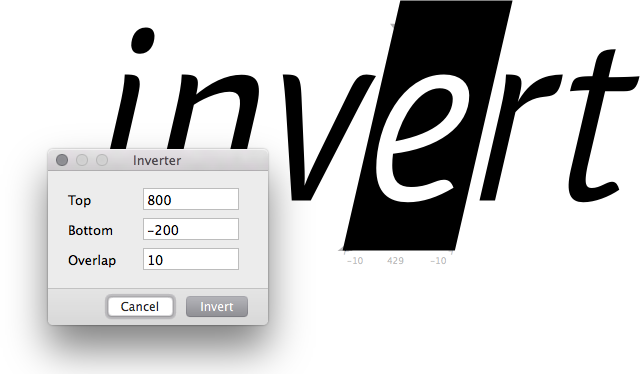

# Inverter.glyphsFilter

This is a plugin for the [Glyphs font editor](http://glyphsapp.com/) by Georg Seifert.
It provides a GUI for inverting glyphs. It puts an enclosing rectangle around your glyphs, slanted to the italic angle. You can set the top and bottom edge, as well as its overlap beyond its sidebearings.

After installation, it will add the menu item *Filter > Inverter*.
You can set a keyboard shortcut in System Preferences.

### Installation

1. Download the complete ZIP file and unpack it, or clone the repository.
2. Double click the .glyphsFilter file. Confirm the dialog that appears in Glyphs.
3. Restart Glyphs

### Usage Instructions

1. Select any number of glyphs in Font or Edit view.
2. Use *Filter > Inverter* to bring up the Inverter window.
3. Set the values. Use up and down arrows to increment and decrement by 1 unit, Shift-arrows for steps of 10 units. You can also use decimal coordinates.
4. Confirm by pressing the *Invert* button.

### Custom Parameter

In *File > Font Info > Instances*, add a new Custom Parameter to an instance. You can trigger the filter with the filter key `Inverter`, e.g.:

    Property: Filter
    Value: Inverter;topEdge;bottomEdge;overlap

Example:

    Property: Filter
    Value: Inverter;800;-200;5

### Requirements

The plugin needs Glyphs 1.4.3 or higher, running on OS X 10.7 or later. It has only been tested in Glyphs 2.0 on OS X 10.10 though. I assume it will not work in versions of Mac OS X older than 10.7.

### License

Copyright 2015 Rainer Erich Scheichelbauer (@mekkablue).
Based on sample code by Georg Seifert (@schriftgestalt).

Licensed under the Apache License, Version 2.0 (the "License");
you may not use this file except in compliance with the License.
You may obtain a copy of the License at

http://www.apache.org/licenses/LICENSE-2.0

See the License file included in this repository for further details.
